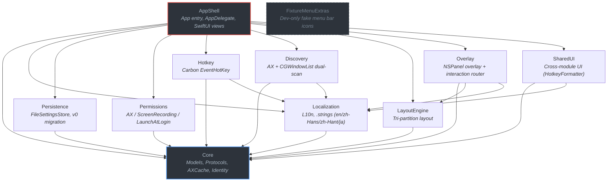
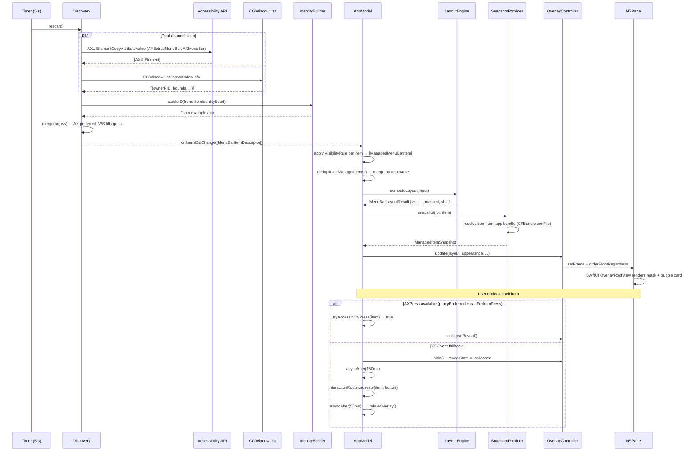
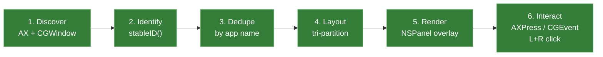

# Architecture

> MenuBarShelf (**fuck-the-menu-bar**) internals.

---

## High-Level Overview (ASCII)

```
                          macOS Menu Bar
                 ┌──────────────────────────────┐
                 │  [Apple][App Menus]  [icons]  │
                 └──────────┬───────────────────┘
                            │ AX API + CGWindowList
                            ▼
          ┌─────────────────────────────────────────┐
          │              Discovery                  │
          │  SystemMenuBarDiscoveryService           │
          │  (scan every 5 s, cache background       │
          │   snapshots, merge dual-channel)         │
          └─────────────────┬───────────────────────┘
                            │ [MenuBarItemDescriptor]
                            ▼
          ┌─────────────────────────────────────────┐
          │              Identity                   │
          │  MenuBarIdentityBuilder                 │
          │  (AX Identifier → title → geometry sig) │
          └─────────────────┬───────────────────────┘
                            │ stable ID per icon
                            ▼
     ┌──────────────────────────────────────────────────┐
     │                  AppModel                        │
     │  (coordinator: settings, permissions, overlay)   │
     │  merges rules + descriptors → ManagedMenuBarItem │
     │  deduplicates by app name, keeps best entry      │
     └────────┬─────────────┬──────────────┬────────────┘
              │             │              │
              ▼             ▼              ▼
   ┌──────────────┐ ┌─────────────┐ ┌─────────────────┐
   │ LayoutEngine │ │  Snapshot   │ │  Interaction     │
   │ (tri-split)  │ │  Provider   │ │  Router          │
   │ visible /    │ │ (app icon   │ │ (AXPress or      │
   │ masked /     │ │  from .app  │ │  CGEvent click   │
   │ shelf        │ │  bundle)    │ │  L/R button)     │
   └──────┬───────┘ └──────┬──────┘ └────────┬─────────┘
          │                │                 │
          └────────────────┼─────────────────┘
                           ▼
          ┌─────────────────────────────────────────┐
          │              Overlay                    │
          │  MenuBarOverlayController               │
          │  (NSPanel: frosted mask + bubble card)  │
          └─────────────────────────────────────────┘
```

---

## Module Dependency Graph (Mermaid)



> **Reading direction**: arrow means "depends on". `AppShell` depends on everything; `Core` depends on nothing.

---

## Data Flow (Mermaid Sequence)



---

## Pipeline: Discovery to Interaction



| Stage | Module | Input | Output | Key Implementation |
|-------|--------|-------|--------|-------------------|
| **1. Discover** | `Discovery` | Running apps, screen geometry | `[MenuBarItemDescriptor]` | `scanAccessibilityItems()` enumerates `AXExtrasMenuBar` / `AXMenuBar` with recursive child traversal (depth 2); `scanWindowServerCandidates()` calls `CGWindowListCopyWindowInfo`; results merged with AX-preferred strategy. Empty AX titles are filtered via `nonEmptyStringAttribute()` |
| **2. Identify** | `Core` | `ItemIdentitySeed` | Stable `String` ID | Priority: AX Identifier > title > geometry signature (`minX:width:height`). Enables persistent rules even when icon positions shift |
| **3. Dedupe** | `AppShell` | `[ManagedMenuBarItem]` | Deduplicated `[ManagedMenuBarItem]` | `deduplicateManagedItems()` groups items by normalized app name (case-insensitive, trimmed). Scoring: user-defined rule (+100), `canPerformPress` (+20), AX source (+10), visibility rule weight (+2/+4). Keeps highest-scoring entry per app |
| **4. Layout** | `LayoutEngine` | `[ManagedMenuBarItem]` + rules + hidden order | `MenuBarLayoutResult` | Items sorted by screen X. Three buckets: `alwaysVisible` (untouched), `hiddenInBar` + `alwaysHidden` (masked), `hiddenInBar` (shelf). Shelf respects user drag-order |
| **5. Render** | `Overlay` | Layout result + appearance settings | On-screen NSPanel | Borderless `NSPanel` at `.statusBar` level, dynamic height based on shelf item count (44 pt collapsed, expands for bubble). Masked items get opaque frosted `RoundedRectangle` overlays (`ultraThinMaterial` layer skipped when mask opacity is 1.0). Shelf rendered as vertical bubble card (`RoundedRectangle(cornerRadius: 24)`) with `ShelfItemRow` per item showing resolved app icon + name. Bubble offset from menu bar is configurable via `bubbleVerticalOffset` (default 58 pt). Global/local click monitors auto-collapse on outside click |
| **6. Interact** | `Overlay` | User click on shelf item | Menu bar action triggered | `AppModel.activate()` first attempts `tryAccessibilityPress()` for left-click + `proxyPreferred` items — on success, collapses overlay without hiding it. On failure (or right-click), hides overlay first, delays 150 ms, then `DefaultMenuBarInteractionRouter.activate()` routes by `ProxyInteractionMode` and `MenuBarClickButton`: left-click tries AXPress then falls back to synthesized `CGEvent`; right-click always synthesizes `CGEvent` right-mouse-down/up at item midpoint. After CGEvent, auto-refreshes overlay state after 50 ms |

---

## Module Details

### Core

Foundation types shared by every module. Zero dependencies.

| Type | Role |
|------|------|
| `MenuBarItemDescriptor` | Value type describing a single menu bar icon (bounds, bundle ID, capabilities, discovery source) |
| `VisibilityRule` / `VisibilityRuleKind` | Per-item user preference: `alwaysVisible`, `hiddenInBar`, `alwaysHidden` |
| `ProxyInteractionMode` | How clicks are routed: `proxyPreferred`, `revealBeforeAction`, `realClickOnly` |
| `MenuBarClickButton` | Which mouse button was used: `.left` or `.right` |
| `AppSettings` | Top-level config container with schema version, rules, appearance, hotkey, language |
| `MenuBarIdentityBuilder` | Deterministic stable-ID generator from `ItemIdentitySeed` |
| `AXElementCache` | `nonisolated(unsafe)` singleton cache mapping item IDs to live `AXUIElement` refs for fast re-press; thread-safe via `NSLock` |
| `ManagedMenuBarItem` | Composite: descriptor + rule + optional snapshot. Primary UI data source. Supports `withDisplayName(_:)` for deduplication |
| `ManagedItemSnapshot` | Snapshot with resolved app icon image and `iconFilePath` from `.app` bundle |
| `MenuBarLayoutInput` / `MenuBarLayoutResult` | Layout engine I/O |

### Discovery

Dual-channel menu bar scanner running on a 5-second `Timer`. Fresh scan results are only published while the application is in the background. When the app is active, the settings UI keeps showing the last background snapshot instead of replacing it with foreground-biased results. Manual refresh from settings performs a controlled background scan by briefly hiding the app, then reopening settings with the refreshed snapshot.

- **AX channel**: Iterates all running applications via `NSWorkspace.shared.runningApplications`, creates `AXUIElementCreateApplication`, reads `AXExtrasMenuBar` and `AXMenuBar`, recursively walks children (depth 2), filters by `isLikelyMenuBarItem(bounds:)` (top-of-screen heuristic +-4 to 40 pt).
- **Window Server channel**: `CGWindowListCopyWindowInfo` with on-screen-only filter, width 10..180 pt guard.
- **Merge strategy**: Window Server items indexed first; AX items overwrite or fill gaps. Capabilities union-merged (`canPerformPress` OR'd, `requiresRealHitTarget` AND'd). Final list sorted left-to-right by `bounds.minX`.

### LayoutEngine

Pure function: `computeLayout(input:) -> MenuBarLayoutResult`.

```
┌──────────┬──────────────────────┬───────────────┐
│ visible  │       masked         │    shelf      │
│ (passed  │  (frosted overlay    │ (shown in     │
│  through)│   hides these)       │  capsule bar) │
└──────────┴──────────────────────┴───────────────┘
```

- `visible` = items with rule `.alwaysVisible`
- `masked` = items NOT `.alwaysVisible` (both `.hiddenInBar` and `.alwaysHidden` get the frosted mask)
- `shelf` = items with rule `.hiddenInBar` only, sorted by user's explicit `hiddenOrder`, fallback by screen X

### Overlay

Three co-located types in the `Overlay` module:

1. **`MenuBarOverlayController`** — Manages a borderless `NSPanel` at `.statusBar` window level. Panel spans full screen width with dynamic height: 44 pt when collapsed, expanding based on shelf item count when revealed. Contains SwiftUI `OverlayRootView` via `NSHostingView`. Renders opaque frosted mask rectangles over hidden items (skips `ultraThinMaterial` layer when mask opacity is 1.0 for performance) and a vertical bubble card (`RoundedRectangle(cornerRadius: 24)`) showing `ShelfItemRow`s with resolved app icons. Bubble vertical offset from the menu bar is configurable via `appearance.bubbleVerticalOffset` (default 58 pt, range 30–120 pt). Registers global and local click monitors to auto-collapse when clicking outside the bubble. Supports `temporarilyReveal(itemID:)` for brief reveal animations. Delayed frame shrink on collapse prevents animation clipping.

2. **`MenuBarSnapshotProvider`** — Resolves app icons from `.app` bundles by reading `CFBundleIconFile` / `CFBundleIconName` / `CFBundleIcons` from `Info.plist`, then searching the bundle's `Resources` directory for `.icns`, `.png`, or `.pdf` files. Falls back to enumerating the Resources directory for any icon file. Cache keyed by item ID with bundle-ID + icon-file-path signature.

3. **`DefaultMenuBarInteractionRouter`** — Implements `MenuBarInteractionRouterProtocol`. Exposes `tryAccessibilityPress(item:) -> Bool` for callers to attempt an AXPress without hiding the overlay first. Accepts a `MenuBarClickButton` parameter (`.left` / `.right`). Three strategies for left-click:
   - `proxyPreferred`: Try `AXUIElementPerformAction("AXPress")` from cache, re-scan on miss, fall back to real click
   - `revealBeforeAction` / `realClickOnly`: Synthesize `CGEvent` mouse down + mouse up at item midpoint
   Right-click always synthesizes `CGEvent` right-mouse-down + right-mouse-up, bypassing AXPress.

### Persistence

`FileSettingsStore` reads/writes `AppSettings` as pretty-printed JSON.

- **Default path**: `~/.config/fuck-the-menu-bar/settings.json`
- **Legacy path**: `~/Library/Application Support/MenuBarShelf/settings.json` (auto-detected for migration)
- **Schema migration**: Attempts v1 decode first; falls back to `LegacyAppSettingsV0` (maps `itemOrder` to `hiddenOrder`)

### Permissions

`PermissionCoordinator` wraps three macOS permission APIs:

| Permission | API | Purpose |
|------------|-----|---------|
| Accessibility | `AXIsProcessTrusted()` / `AXIsProcessTrustedWithOptions()` | Item enumeration & AXPress |
| Screen Recording | `CGPreflightScreenCaptureAccess()` / `CGRequestScreenCaptureAccess()` | Icon pixel capture |
| Launch at Login | `SMAppService.mainApp` | Login item registration |

Returns `PermissionSnapshot` — a frozen value type consumed by UI and decision logic.

### Hotkey

`GlobalHotkeyMonitor` registers a system-wide hotkey via Carbon `RegisterEventHotKey`.

- Signature: `0x4D425348` ("MBSH")
- Default: keyCode 46 (`M`), modifiers `cmdKey | optionKey` = `Cmd+Opt+M`
- `update(configuration:handler:)` unregisters previous, installs new `EventTypeSpec` + hot key
- Handler closure calls `AppModel.toggleReveal()`

### Localization

`LocalizationController` (singleton, `ObservableObject`) switches between bundled `.lproj` resources at runtime.

- Supported: `en`, `zh-Hans`, `zh-Hant`, `ja`
- `L10n.string(_:)` / `L10n.format(_:_:)` — convenience static API
- Language change triggers `objectWillChange` → all subscribed SwiftUI views re-render

### SharedUI

Cross-module UI utilities. Currently contains `HotkeyFormatter` for displaying human-readable key combinations in the settings UI.

### AppShell

Application entry point and coordination hub.

- **`AppDelegate`** — `NSApplicationDelegate`, creates `NSStatusItem`, wires `AppModel`
- **`StatusItemController`** — Manages the status bar button (the `≡` toggle)
- **`SettingsWindowController`** — Hosts the SwiftUI settings window
- **`AppModel`** — `@MainActor ObservableObject`, the central coordinator:
  - Owns instances of all service types
  - Reacts to `onItemsDidChange` from Discovery
  - Deduplicates discovered items by app name via `deduplicateManagedItems()` with scoring-based selection
  - Filters out self-referencing items via `isCurrentAppItem()` (PID, bundle ID, and display name matching)
  - `activate()` uses a two-phase strategy: first attempts `tryAccessibilityPress()` (no overlay hide needed), falls back to hiding overlay + delayed CGEvent + 50 ms post-click refresh
  - Drives layout computation and overlay updates
  - Persists settings on every mutation
  - Manages hotkey registration lifecycle
  - Handles permission refresh on app/session activation

### FixtureMenuExtras

Standalone executable (`swift run FixtureMenuExtras`) that injects 4-5 fake `NSStatusItem` icons into the menu bar. Used during development to test Discovery and Layout without real third-party apps.

---

## Threading Model

| Context | Guarantee |
|---------|-----------|
| `AppModel`, all service types | `@MainActor` |
| `AXElementCache` | `nonisolated(unsafe) static let shared` — thread-safe via `NSLock` |
| `LocalizationController` | `nonisolated(unsafe) static let shared` — reads on main, apply on main |
| Discovery timer | `Timer.scheduledTimer` on main run loop (5 s interval), rescans dispatch back to `@MainActor`; fresh results are published only while app is inactive, with a cached background snapshot shown while active |
| Hotkey handler | Carbon event handler calls closure on main thread |
| Model types (`AppSettings`, `MenuBarItemDescriptor`, etc.) | `Sendable` value types |

The entire app runs on the main actor. No background queues, no concurrent data access (except `AXElementCache` which uses `NSLock` for thread safety after being decoupled from `@MainActor`). This is deliberate: Accessibility APIs (`AXUIElement*`) and AppKit UI must run on the main thread, and the workload (scanning ~50 items every 5 seconds) is trivially fast.

---

## Configuration Schema

```
settings.json (schemaVersion: 1)
├── rules: { [itemID]: VisibilityRule }
│   ├── itemID: String           ← MenuBarIdentityBuilder.stableID
│   ├── kind: VisibilityRuleKind ← alwaysVisible | hiddenInBar | alwaysHidden
│   ├── customName: String?      ← user-defined display name
│   └── interactionMode          ← proxyPreferred | revealBeforeAction | realClickOnly
├── hiddenOrder: [String]        ← ordered shelf item IDs
├── appearance: AppearanceSettings
│   ├── collapsedMaskOpacity: 1.0
│   ├── animationDuration: 0.18
│   └── bubbleVerticalOffset: 58
├── hotkey: HotkeyConfiguration
│   ├── keyCode: 46 (M)
│   ├── modifiers: 2304 (Cmd+Opt)
│   └── isEnabled: false
├── preferredLanguage: AppLanguage
├── launchAtLogin: Bool
└── completedOnboarding: Bool
```

---

## Build Targets

| Target | Type | Description |
|--------|------|-------------|
| `fuck-the-menu-bar` | Executable | Main application (`AppShell`) |
| `FixtureMenuExtras` | Executable | Dev-only fake menu bar icons |
| `Core` | Library | Shared models and protocols |
| `Localization` | Library | L10n engine + bundled `.strings` |
| `Persistence` | Library | Settings JSON I/O |
| `Permissions` | Library | macOS permission wrappers |
| `Hotkey` | Library | Global hotkey registration |
| `Discovery` | Library | Menu bar item scanner |
| `LayoutEngine` | Library | Layout computation |
| `Overlay` | Library | Window overlay + interaction |
| `SharedUI` | Library | Cross-module UI helpers |
| `CoreTests` | Test | Identity builder tests |
| `LayoutEngineTests` | Test | Layout tri-partition tests |
| `PersistenceTests` | Test | Settings serialization + migration tests |
